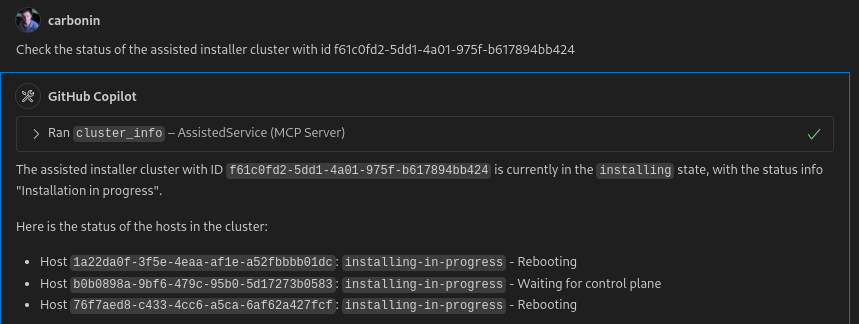

# Assisted Service MCP Server

MCP server for interacting with the OpenShift assisted installer API.

Diagnose cluster failures and find out how to fix them.

Try it out:

1. Clone the repo:
```
git clone git@github.com:carbonin/assisted-service-mcp.git
```

2. Get your OpenShift API token from https://cloud.redhat.com/openshift/token

3. The server is started and configured differently depending on what transport you want to use

For STDIO:

In VSCode for example:
```json
   "mcp": {
        "servers": {
            "AssistedService": {
                "command": "uv",
                "args": [
                    "--directory",
                    "/path/to/assisted-service-mcp",
                    "run",
                    "mcp",
                    "run",
                    "/path/to/assisted-service-mcp/server.py"
                ],
                "env": {
                    "OFFLINE_TOKEN": <your token>
                }
            }
        }
    }
```

For SSE (recommended):

Start the server in a terminal:

`OFFLINE_TOKEN=<your token> uv run server.py`

Configure the server in the client:

```json
    "assisted-sse": {
      "transport": "sse",
      "url": "http://localhost:8000/sse"
    }
```

### Providing the Offline Token via Request Header

If you do not set the `OFFLINE_TOKEN` environment variable, you can provide the token as a request header.
When configuring your MCP client, add the `OCM-Offline-Token` header:

```json
    "assisted-sse": {
      "transport": "sse",
      "url": "http://localhost:8000/sse",
      "headers": {
        "OCM-Offline-Token": "<your token>"
      }
    }
```

4. Ask about your clusters:


## Available Tools

The MCP server provides the following tools for interacting with the OpenShift Assisted Installer:

### Cluster Management

* **list_clusters** - Lists all current user assisted installer clusters. Returns minimal cluster information.

* **cluster_info** - Get detailed information about the assisted installer cluster with the given ID
  * `cluster_id`: Cluster ID (string, required)

* **create_cluster** - Create a new assisted installer cluster and infraenv. Set single_node to true only for single node clusters or when high availability is not needed. Returns cluster ID and infraenv ID as JSON.
  * `name`: Cluster name (string, required)
  * `version`: OpenShift version (string, required)
  * `base_domain`: Base domain for the cluster (string, required)
  * `single_node`: Whether to create a single node cluster (boolean, required)

* **install_cluster** - Trigger installation for the assisted installer cluster with the given ID
  * `cluster_id`: Cluster ID (string, required)

* **set_cluster_vips** - Set the API and ingress virtual IP addresses (VIPs) for the cluster
  * `cluster_id`: Cluster ID (string, required)
  * `api_vip`: API virtual IP address (string, required)
  * `ingress_vip`: Ingress virtual IP address (string, required)

### Events and Monitoring

* **cluster_events** - Get the events related to a cluster with the given ID
  * `cluster_id`: Cluster ID (string, required)

* **host_events** - Get the events related to a specific host within a cluster
  * `cluster_id`: Cluster ID (string, required)
  * `host_id`: Host ID (string, required)

### Infrastructure Environment

* **infraenv_info** - Get detailed information about the assisted installer infra env with the given ID. Contains data like ISO download URL and infra env metadata.
  * `infraenv_id`: Infrastructure environment ID (string, required)

### Host Management

* **set_host_role** - Update a host to a specific role. Role options are: 'auto-assign', 'master', 'arbiter', 'worker'
  * `host_id`: Host ID (string, required)
  * `infraenv_id`: Infrastructure environment ID (string, required)
  * `role`: Host role (string, required)

### OpenShift Versions and Operators

* **list_versions** - Lists the available OpenShift versions for installation with the assisted installer

* **list_operator_bundles** - Lists the operator bundles that can be optionally added to a cluster during installation

* **add_operator_bundle_to_cluster** - Request an operator bundle to be installed with the given cluster
  * `cluster_id`: Cluster ID (string, required)
  * `bundle_name`: Operator bundle name (string, required)

### Usage Examples

* **List all clusters**: "Show me all my clusters"
* **Get cluster details**: "Give me detailed information about cluster abc123"
* **Create a cluster**: "Create a new cluster named 'my-cluster' with OpenShift 4.14 and base domain 'example.com'"
* **Check cluster events**: "What events happened on cluster abc123?"
* **Install a cluster**: "Start the installation for cluster abc123"
